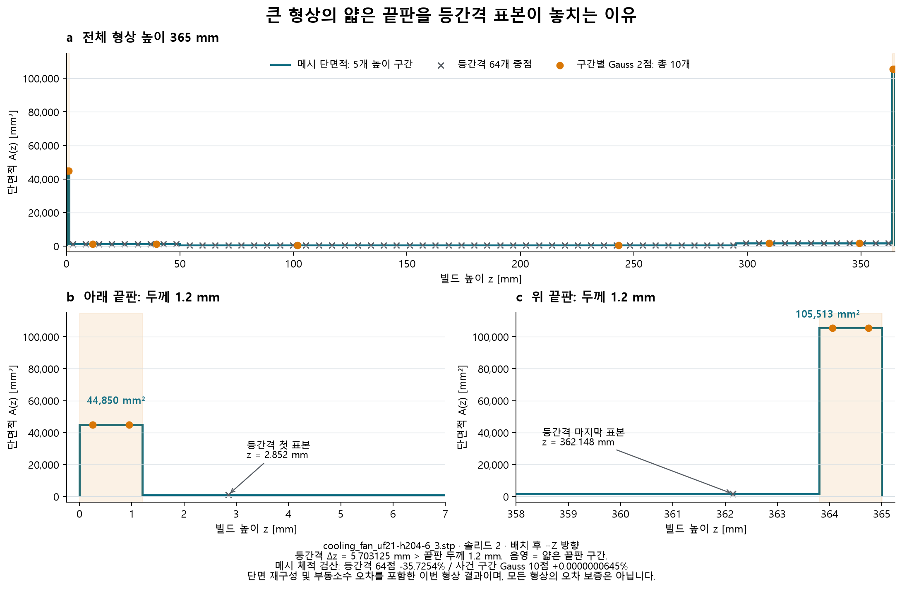

# 형상 변화 높이에 맞춘 단면 체적 검산

균등 단면 수만 늘리면 얇은 판을 놓치거나 판의 체적을 과대평가할 수 있다. 실제 냉각팬 솔리드2의 1.2 mm 끝판은 64개 균등 표본에서 누락됐고, 1,024개에서도 메시 체적과 약 −3.91% 차이가 남았다. 이 반례 때문에 단면 배치 방법을 선택할 수 있게 했다. 원래 균등 표본 결과는 보존한다. [반례와 독립 대조](project-knowledge/CROSS_SECTION_ALIASING_2026-09-15.md).

## 수학적 근거와 적용 대상

닫힌 비자기교차 삼각형 메시를 고정하고 모든 정점의 빌드 Z를 정렬한다. 이웃한 서로 다른 Z 사이에는 삼각형의 단면 교차 관계가 바뀌지 않는다. 각 모서리와 수평면의 교점 좌표는 Z의 일차식이고, 닫힌 다각형의 shoelace 면적은 이차식이다. 내부 윤곽의 면적을 빼는 재료 단면도 같은 성질을 가진다. 이 유도는 입력의 유효한 재료 경계와 닫힌 단면을 전제로 한다.

구간 (a,b)의 두 표본은 `z=(a+b)/2 ± (b−a)/(2√3)`, 각 가중치는 `(b−a)/2`다. 2점 Gauss–Legendre 규칙은 정확한 산술에서 3차 이하 다항식을 적분한다. 따라서 구간별 이차 단면적을 두 값으로 적분할 수 있다. 일반 Gauss 적분 오차와 Legendre 규칙은 [NIST DLMF §3.5(v), 식 3.5.19·3.5.21](https://dlmf.nist.gov/3.5.v)에 근거한다. 이는 고정 다면체의 기하학적 유도이며 CAD 곡면이나 적층제조 물리의 정확도 정리가 아니다.

실제 구현은 부동소수점과 단면 좌표 그리드를 사용한다. 전체 위상 검사도 모든 자기교차를 검출하는 증명은 아니다. 별도의 사면체 체적과 비교하고, 닫히지 않은 단면과 수치적으로 분리되지 않는 구간은 미확정으로 남긴다.

## 측정 계약

- 현재 선택 방향과 평면 내 회전을 포함한 최종 배치를 그대로 사용한다. 입력을 축소하거나 원본을 편집하지 않는다.
- 정점 높이를 임의의 간격으로 합치지 않는다. 두 내부 표본을 서로 다르게 표현할 수 없는 구간은 생략 사실과 누락 높이를 기록하고 전체 체적은 `None`으로 남긴다. 누락 높이와 XY 외곽 면적으로 계산한 범위는 그 누락 구간에만 해당하며 전체 수치 오차 한계가 아니다.
- 기본 한도는 8,192개 단면과 예상 교차 선분 150만 개다. 둘 중 하나라도 넘으면 전체 사건 검산을 보류한다. 균등 방법으로 자동 치환하거나 일부 구간을 골라 완전한 적분이라고 부르지 않는다. 앱 실행 시간 한도는 90초다.
- 모든 필요한 단면이 확정됐을 때만 `volume_quadrature_estimate_mm3`를 제공한다. 기존 `volume_midpoint_estimate_mm3`와 별개다.
- 면적·둘레·A/P·영역 수·내부 윤곽 수·이전 확정 단면과의 대칭차를 표시한다. 불균등한 표본 간격에서 대칭차 면적은 단위 높이 변화율이 아니다.
- **두 표본의 최대 면적은 구간의 최대 면적이 아니다.** 원뿔에서도 체적 적분은 맞지만 아래 끝면의 최대 면적을 직접 찍지 않는다. UI와 보고서는 계속 ‘표본 최대’라고 표시한다.
- 체적 차이가 작더라도 국소 특징·곡면 근사·공정 합격을 보증하지 않는다. 조립체의 재료 합집합, 미확정 여러 메시, 재료 내부 없는 곡면 STEP은 별도 솔리드 선택 또는 판정 보류가 필요하다.

4개 공정에서 동일한 기하 계산을 사용하며 결과의 제조 의미는 공정별 문헌에 연결한다. VPP 박리력·흡착 컵, PBF 열변형·분말 제거 성공, FDM 압출 경로의 성공을 새 적분법으로 확정하지 않는다. [공정별 문헌 조건](research/AM_DFM_EVIDENCE_REAUDIT.md).

## 재현

`run_detail(model, profile, direction, mode="sections", sampling="events")`로 작업자 격리·시간 한도·모델/프로필/방향 일치 검사를 적용한다. 기존 호출의 기본값 `sampling="uniform"`은 유지한다. 앱에서는 ‘정밀 검토 → 단면 배치 방법’에서 두 방법을 선택한다.

단위 반례는 `tests_v3/test_event_sections.py`, 4공정 API와 UI 통합은 `test_cross_sections.py`·`test_app.py`에 있다. 전수 실행에서 사용한 코드 지문·대상·부분 결과는 최종 검토 기록에 별도로 보존한다.
