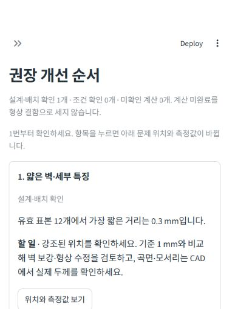

# 사용자 중심 검토와 AI 입력 연결 검증 · 2026-09-28

실제 제조 실험이나 AI 모델의 의미 이해 정확도 검증과 소프트웨어 검사를 구분한다. API 키가 없는 환경이므로 실제 OpenAI 호출은 0회다. API 응답을 모의한 검사는 연결 규약·검증·오류 처리·조건 전달을 확인한다.

## 코드와 환경

- Git 기준 HEAD: `d8d1ab010f24111f8f2835157ccd4b93de667a00`. 기존 미커밋 조건 DB·사용 흐름 개선 위에 이번 변경을 반영했다.
- 저장소: Windows, Python 3.12.14, Streamlit 1.63.0. BLAS/OMP/MKL/NUMEXPR 스레드 각각 1.
- 전체 회귀 시 계산 코드 SHA: `908439b9f80d795e78c8343fd31b873124b8a78821383a49798f5f06e2b507da`.
- 최종 계산 코드 SHA: `de319a135a34fe9395c838e1e1f108857c099332ceea87fa9bb62cda698f1462`.
- 조건 DB SHA: `612271b440d99de8093889e64de1a4755e27eda61a359185158a1e7a5812a050`.

## 시험 결과

| 실행 | 결과 | 원본 기록 |
|---|---|---|
| `tests_v3 --ignore=tests_v3/test_advisor_ui.py` | 1,003 통과, 759.79초 | `regression.txt`, `regression.xml` |
| `tests` | 167 통과, 76.18초 | `legacy.txt`, `legacy.xml` |
| `tests_v3/test_advisor_ui.py` | 8 통과, 68.75초 | `ai-ui.txt`, `ai-ui.xml` |
| 마지막 화면·상태 수정 후 관련 6개 파일 | 57 통과, 234.41초 | `final-related.txt`, `final-related.xml` |
| 실제 AM/CNC 엔진의 기본 강조 위치 반례 | 2 통과, 30.19초 | `focus.log`, `focus.xml` |

전체 회귀의 서로 다른 검사는 1,178개다. 이후 57개는 관련 항목의 재검사이며 합산해 고유 검사 수로 설명하지 않는다. 마지막 2개는 새로 추가한 독립 사용자 흐름 검사다. 마지막 수정은 `advisor_view.py`의 입력/파일명 안내와 AM/CNC의 우선순위 변경 시 기본 강조 위치 갱신이다. 전체 계산 엔진은 변경하지 않았다. 최종 코드에 대한 전체 1,180개 일괄 재실행을 주장하지 않는다.

기존 `tests`에서 Trimesh의 체적 0 중심 계산 경고 1건이 발생했다. 실패는 없다. 개발 중 최초 실패·수정 기록은 저장소 옆 `study/ai-advisor-2026-09-28/`의 당시 기록을 보존한다.

## 확인한 반례

- 우선순위만 변경했을 때 캐시된 형상 계산 결과라도 조치 순서·기본 강조 위치가 새 요구를 따른다. 동일 결과에서 수동 선택한 위치는 유지한다.
- AM 장비/재료를 바꾸면 이전 자료의 수치 기준이 새 장비에 잘못 남지 않는다. 중점만 바꿀 때 수치 기준은 유지한다.
- 지원하지 않는 강도/비용 등의 요구를 물리 해석이나 성공률로 바꾸지 않는다.
- 미완료·미측정·입력 장애를 정상 판정으로 승격하지 않는다.
- 실제 조건 후보는 출처와 가져올 값을 확인한 뒤에만 적용한다. AI 장비명 추출만으로 수치 조건을 적용하지 않는다.
- AI 입력 변경 후 오래된 해석을 적용할 수 없고, API 오류·거부·불완전 응답·추정한 이름·잘못된 스키마를 거부한다. 키와 응답 원문을 보고서에 넣지 않는다.

## 실제 AI 평가 준비 상태

`intent-cases.json`은 한국어 12개 작성 사례다. `intent-fixtures-offline.json`은 사례 형식 검사 결과이며 모델의 정답률이 아니다. API 연결 시 `scripts/evaluate_ai_intent.py --live --output <새 경로>`로 명시적으로 실행한다. 모델이 실제 장비·공정·부정/상충 의도를 얼마나 잘 이해하는지는 아직 확인하지 않았다.

## 바탕화면·브라우저

실행본은 `C:/Users/JIN/Desktop/AM-DFM_v3_0`이다. 배치는 기존 `release_manifest.json`과 SHA를 대조하고 교체 전 파일을 백업하는 허용 목록 복사로 진행한다. 키·원본 자료를 복사하거나 삭제하지 않는다. 배치별 원본 기록은 `study/ai-advisor-2026-09-28/desktop-sync-*.json`이다.

실제 브라우저에서 얇은 판 0.3 mm를 검토하여 관측값·다음 행동·위치 버튼을 확인했다. 화면 확인용 기준 1 mm는 **가상 기준**으로 표시했으며 제조사 장비 한계가 아니다. `browser-action-card.png`는 마지막 강조 상태 수정 전의 실제 화면이다. 최종 배치·검사는 아래 완료 기록에 추가한다.

### 최종 완료 기록

- 18:40 KST 배치: `desktop-sync-20260928-184028.json`. 3개 추가·4개 교체, 기존 파일 백업 후 SHA 대조 완료. 실행 서버를 중지하고 최종 코드로 다시 시작했다.
- 저장소와 바탕화면의 최종 계산 코드 SHA가 위의 `de319a...`로 일치함을 확인했다.
- 바탕화면 Python 3.13.15 환경에서 `test_advisor_ui.py` + `test_advisor_focus.py`: **10개 통과, 91.66초**. `desktop-final.txt`, `desktop-final.xml`에 보존했다. 이는 앞서 센 항목의 다른 환경 재검사다.
- 실제 브라우저 최종 화면: `browser-final-action-card-verified.png`. 일반 387 × 510 뷰포트에서 사이드바를 접고, 가상 1 mm 기준과 0.3 mm 측정값·할 일·위치 확인 버튼을 확인했다. `browser-final-action-card.png`는 사이드바가 아직 열린 중간 캡처이며 최종 증거로 사용하지 않는다.
- AI 입력 펼침에서 ‘AI 미연결’ 및 비활성 해석 버튼을 확인했다. 키 입력·실제 API 요청은 하지 않았다.

